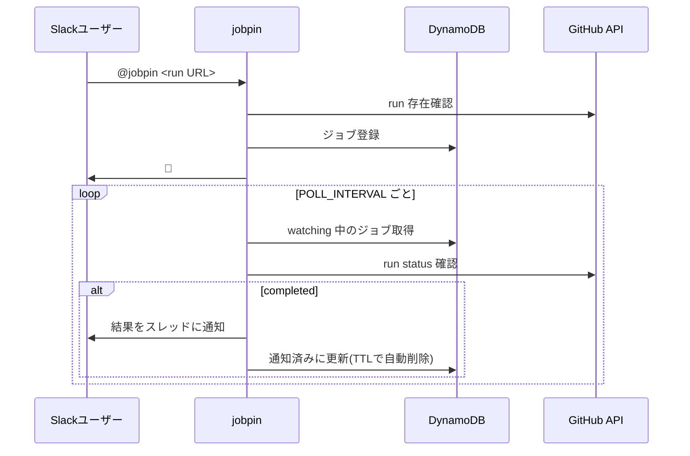

# jobpin

GitHub Actions のジョブを監視して、完了・失敗を Slack に通知する bot。

## 使い方

Slack のチャンネルやスレッドで bot にメンションする。

```
@jobpin https://github.com/owner/repo/actions/runs/123456789
```

- 受け付けると 👀 リアクションが付き、run が完了したら結果をスレッドに通知する
- すでに完了している run はその場で結果を返信する
- 1メッセージに複数の run URL を含めてもよい

## アーキテクチャ



## 設定

すべて環境変数で設定する。

| 変数 | 必須 | デフォルト | 説明 |
|---|---|---|---|
| `SLACK_BOT_TOKEN` | ✓ | - | Bot User OAuth Token (`xoxb-`) |
| `SLACK_APP_TOKEN` | ✓ | - | App-Level Token (`xapp-`、Socket Mode 用) |
| `GITHUB_TOKEN` | ※ | - | PAT。設定時は PAT 認証 |
| `GITHUB_APP_ID` | ※ | - | GitHub App の App ID |
| `GITHUB_APP_PRIVATE_KEY_PATH` | ※ | - | GitHub App の秘密鍵ファイルパス |
| `DYNAMODB_TABLE` | | `jobpin` | テーブル名(無ければ自動作成) |
| `DYNAMODB_ENDPOINT` | | - | DynamoDB Local 等のエンドポイント |
| `POLL_INTERVAL` | | `30s` | 監視間隔 |
| `WATCH_TTL` | | `168h` | 監視レコードの保持期間 |
| `ACK_REACTION` | | `eyes` | 受付時のリアクション |
| `NOTIFY_TEMPLATE_SUCCESS` | | 下記 | 成功時の通知テンプレート |
| `NOTIFY_TEMPLATE_FAILURE` | | 下記 | 失敗時の通知テンプレート |

※ `GITHUB_TOKEN` か `GITHUB_APP_ID` + `GITHUB_APP_PRIVATE_KEY_PATH` のどちらかが必須。GitHub App の場合、installation は対象リポジトリから自動解決する。

AWS 認証は SDK 標準(`AWS_REGION`、`AWS_PROFILE`、IAM ロール等)に従う。

### 通知テンプレート

Go の `text/template` 形式。使える変数: `.Requester` `.Owner` `.Repo` `.RunID` `.RunURL` `.WorkflowName` `.RunNumber` `.Status` `.Conclusion` `.Branch`

デフォルト:

```
成功: <@{{.Requester}}> :white_check_mark: *{{.WorkflowName}}* (#{{.RunNumber}}) が成功しました\n{{.RunURL}}
失敗: <@{{.Requester}}> :x: *{{.WorkflowName}}* (#{{.RunNumber}}) が {{.Conclusion}} で終了しました\n{{.RunURL}}
```

## Slack App の設定

1. Socket Mode を有効化し App-Level Token(`connections:write`)を発行
2. Bot Token Scopes: `app_mentions:read` `chat:write` `reactions:write`
3. Event Subscriptions で `app_mention` を購読
4. bot を対象チャンネルに招待

## 開発

```sh
make up    # DynamoDB Local 起動
make test
make build
```

## Docker

```sh
docker build -t jobpin .
docker run --rm -e SLACK_BOT_TOKEN=... -e SLACK_APP_TOKEN=... -e GITHUB_TOKEN=... jobpin
```
